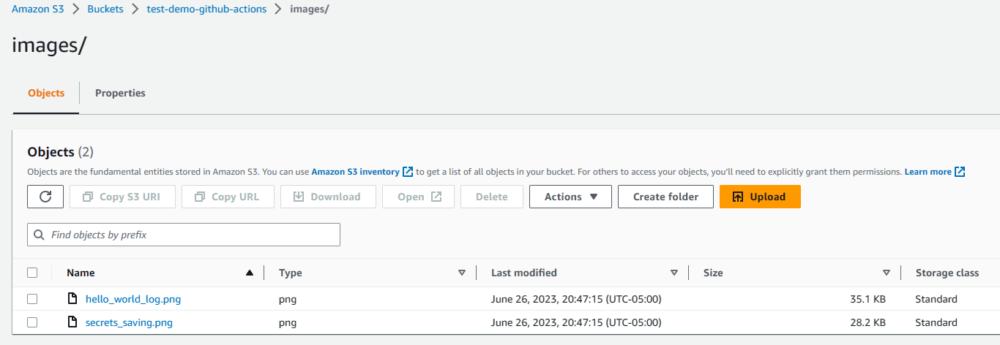

# GitHub Actions
This project is created to get the first steps on working with Github Actions.

# Index

- [Intro](#intro)
  - [First "Hello World!" job](#first-hello-world-job)
- [Directory Structure](#directory-structure)
- [Execution and Extra Examples](#execution-and-extra-examples)
  - [How to trigger](#infrastructure-description-summary)
  - [Where does it runs?](#where-does-it-runs)
  - [Using secrets and enviroment variables](#using-secrets-and-enviroment-variables)
  - [Use cases](#use-cases)
- [Marketplace](#marketplace)

# Intro

GitHub Actions is a CI/CD tool that helps you automate and streamline your software development process. It allows you to automatically build, test, and deploy your code, making it easier and faster to release high-quality software.

With GitHub Actions, you can create sets of instructions called workflows that take care of repetitive tasks for you. For example, when someone suggests changes to your code, GitHub Actions can automatically build and test those changes to make sure they work properly. It can even deploy the changes to a live website or app after they have been reviewed and approved.

But GitHub Actions isn't just limited to technical stuff. It can also help you with other tasks related to managing your project. For instance, if someone opens a new issue on your project, GitHub Actions can automatically add relevant labels to it, making it easier to track and organize.

GitHub Actions offers different options for running your workflows. You can use the virtual machines provided by GitHub, which come in different operating systems like Linux, Windows, and macOS. Alternatively, you can use your own machines or servers, whether they are in your own data center or in the cloud. This gives you the flexibility to choose the environment that works best for you.

## First "Hello World!" job

For the demonstration of a first execution of "Github Actions", we developed in the `.github/workflows` folder a file called `demo_hello_world_1.yml`.

We can take a look to the code [here](./.github/workflows/demo_hello_world_1.yml).

And also, to the logs of the execution 


# Directory Structure

```console
.
├── documentation
│   └── images
│       ├── hello_world_log.png
│       ├── secrets_saving.png
│       └── sync_with_s3_bucket.png
├── README.md
└── .github
    └── workflows
        ├── demo_hello_world_1.yml
        ├── demo_hello_world_2.yml
        ├── demo_with_secrets.yml
        ├── sync_files_with_s3.yml
        └── cubejs_project.yml
```

## documentation

Parent directory which holds supporting readme files as well as supporting images for the documentation.

### images

Folder which contains images being used by the documentation resources.

# Execution and Extra Examples

## How to trigger

In order to execute our Workflows, there're different criterias on conditionals that needs to be matched on a commit/pull request.

For our `demo_hello_world_1` and `demo_hello_world_2` we can see on top of the Workflows a first "filter":

```
...

on:
  - push
  - pull_request

...
```
It defines which events can cause the workflow to run.

And, as in the case of `sync_files_with_s3` workflow, we can work with a slightly different sintaxis that also "filter" by branches and path modified in the branch.

```
...

on:
  push:
    branches: ['master']
    paths: ['documentation/images/**']

...

```

## Where does it runs?

Github offer a variaty of Runner images that can be used for each job you have in your workflow, and also, you can properly setup a self-hosted runner in your "Settings/Code and automation/Actions/Runners" section.

Take a look to all the availables runners offered by Github [here](https://docs.github.com/en/actions/using-jobs/choosing-the-runner-for-a-job#choosing-github-hosted-runners)

## Using secrets and enviroment variables

Environment variables and secrets in GitHub Actions are used to store and access data across workflow steps. They allow you to customize behavior, pass dynamic information, and securely store secrets. You can define, set, and access these variables in your workflow files using the `env` or `secrets` keyword or GitHub Actions UI. Predefined variables are also available for accessing useful information about the workflow and repository.

For example, in our repo, we define secrets in the `Settings/Security/Secrets and variables/Actions/Secrets` section, hitting the "New repository secret" like this:


Allowing us to call them in this way, as in `demo_with_secrets.yml`:

```
...

jobs:
  my-job:
    runs-on: ubuntu-latest
    env:
        HOSTNAME: ${{ secrets.HOSTNAME }}
        USERNAME: ${{ secrets.USERNAME }}
        AWS_PRIVATE_KEY: ${{ secrets.AWS_PRIVATE_KEY }}
...

```

By using this way, we won't display the enviroment variables/secrets in the logs of the workflow. Instead, we will see `"****"` as the value of the env variable.

## Use cases

We can see for the demo porpouses, that, we have three workflows.

`demo_with_secrets.yml` Show us a way to connect to a EC2 instance using the Hostname, Username and AWS Private Key to get an SSH connection. We test, as if we were running from our CLI, that we successfully connected to it.

`sync_files_with_s3.yml` Show us a way to sync files from our repo with a S3 bucket. We uses `AWS_REGION`, `AWS_ACCESS_KEY_ID`, `AWS_SECRET_ACCESS_KEY` and `S3_BUCKET` secrets in order to setup a step that handles the connection to the AWS account, using the `configure-aws-credentials@v1` action, `actions/checkout@v2` to checkout or repo and finally, use the `aws s3 sync` command to sync the files between our repo and the S3 bucket.

There's also a screenshot of what happens after the first commit, in the S3 bucket:



# Marketplace

You might wonder, where can I find those actions previously mentioned in the `Use cases` section? Well, there're tons of them in the link below, use them wisely in your project, and good luck! 

<https://github.com/marketplace?type=actions>
